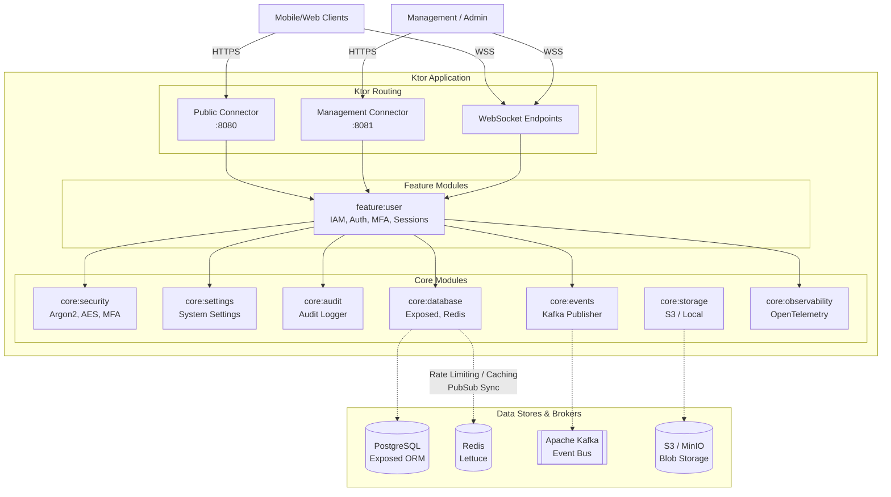
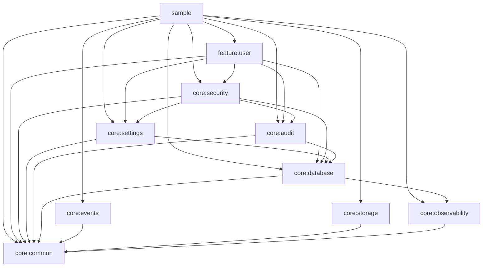

# Backend Platform SDK Architecture

This document describes the high-level architecture and module dependency graph of the `backend-platform-sdk`.

For detailed domain models and sequence diagrams of specific runtime flows, please refer to the specialized documentation in the `docs/architecture` directory:

- **[Identity & Access Domain Models](docs/architecture/identity_and_access.md)** — Core models: Roles, Permissions, Account Statuses (with State Machine), Identifiers, and Sessions.
- **[Authentication Flows](docs/architecture/flows/authentication.md)** — Registration, Email, Phone (SMS OTP), External Providers (OAuth), and Token Refresh workflows.
- **[Account Management Flows](docs/architecture/flows/account_management_flows.md)** — Schedule Account Deletion and Restoration workflows.
- **[Security Flows](docs/architecture/flows/security.md)** — TOTP MFA Initialization, Brute-Force Protection, and Lockout mechanisms.
- **[Settings & Cache Synchronization](docs/architecture/flows/settings_and_cache.md)** — Global settings updates and multi-node Redis cache invalidation.
- **[WebSocket Synchronization](docs/architecture/flows/websockets.md)** — Stateless real-time broadcasting via Redis Pub/Sub.
- **[Audit & Masking](docs/architecture/flows/audit.md)** — Asynchronous event logging, error parsing, and PII masking.
- **[Scheduled Background Jobs](docs/architecture/flows/background_jobs.md)** — Periodic cleanup of expired sessions, permanent user deletions, and unbanning accounts.
- **[Events & Storage Infrastructure](docs/architecture/flows/events_and_storage.md)** — Kafka event pub/sub and Blob storage (S3/Local) abstractions.

---

## 1. High-Level Architecture

The platform is designed as a modular Ktor microservice architecture. It exposes multiple HTTP and WebSocket connectors (split by Open and Management APIs) and delegates to isolated features (`feature:*`) backed by reusable infrastructure modules (`core:*`). State is persisted in PostgreSQL, cached/synchronized via Redis, and background events are published to a Kafka message broker.

---

## 2. Module Dependency Graph

The project utilizes a clear layered approach. `core:common` is the base for all modules. `feature:user` aggregates the domain logic, security constraints, and database transactions before being assembled by the `sample` host application.

