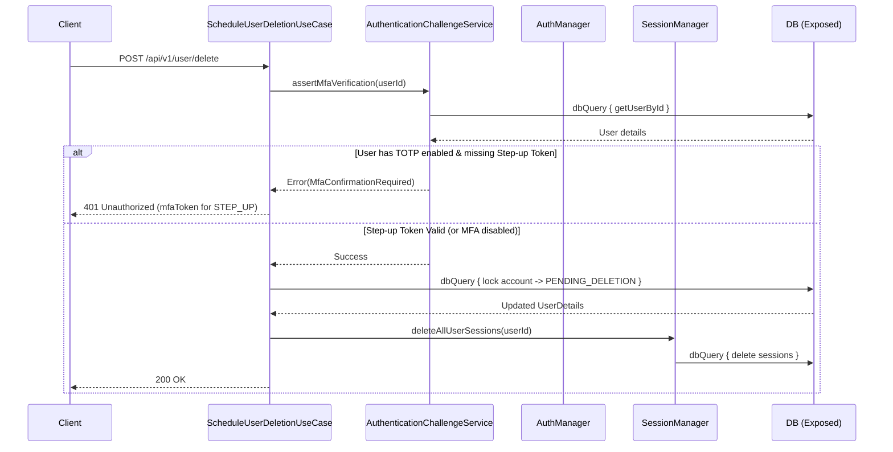
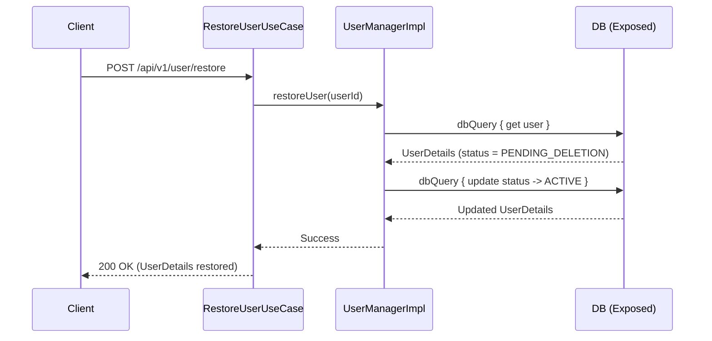

# Account Management Flows

This document outlines the workflows for account deletion and restoration within the `backend-platform-sdk`.

*For detailed information on User Roles, Statuses, Identifiers, and Sessions, see the [Identity & Access Domain Models](../identity_and_access.md).*

## 1. Schedule Account Deletion (MFA Step-up)

Demonstrates a destructive action that requires MFA confirmation (Step-up authentication) if TOTP is enabled on the account. It transitions the `UserAccountStatus` to `PENDING_DELETION`.

## 2. Restore User Account

If a user logs back in during the grace period (while in `PENDING_DELETION`), they are prompted to restore their account, which aborts the scheduled deletion.

