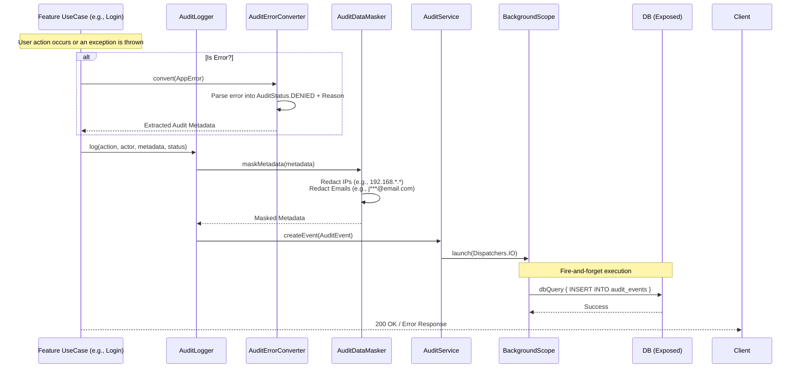

# Audit & Masking

This document explains the asynchronous audit logging infrastructure and data masking mechanisms used across the `backend-platform-sdk`.

## 1. Permissions & Access Levels (`AuditAccessFilter`)

Reading audit logs (e.g., via the Management API's `GetAuditEventsUseCase`) is strictly controlled by Role-Based Access Control (RBAC). 

The module uses an `AuditAccessFilter` which dynamically modifies the SQL queries at the database level (`Exposed` ORM). Depending on the caller's role (`UserRole`) and explicitly granted permissions (`AuditPermissionCode`):
- A `STAFF` user might only see events generated by regular `USER` actors, but not administrative events.
- An `ADMIN` user with full read permissions will see all system-wide events.

This guarantees that sensitive audit trails are never leaked to callers lacking the appropriate authorization.

## 2. Asynchronous Audit Logging & Data Masking

The audit system intercepts actions (both successful and failed), extracts relevant metadata (like User Agents, IP addresses), applies sensitivity masking (e.g., hiding full email addresses), and persists the record asynchronously in the background so it doesn't block the HTTP response.

