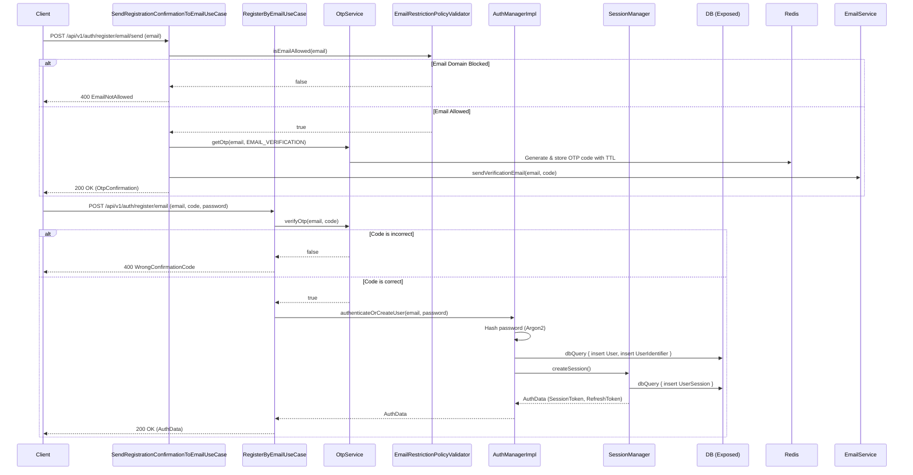
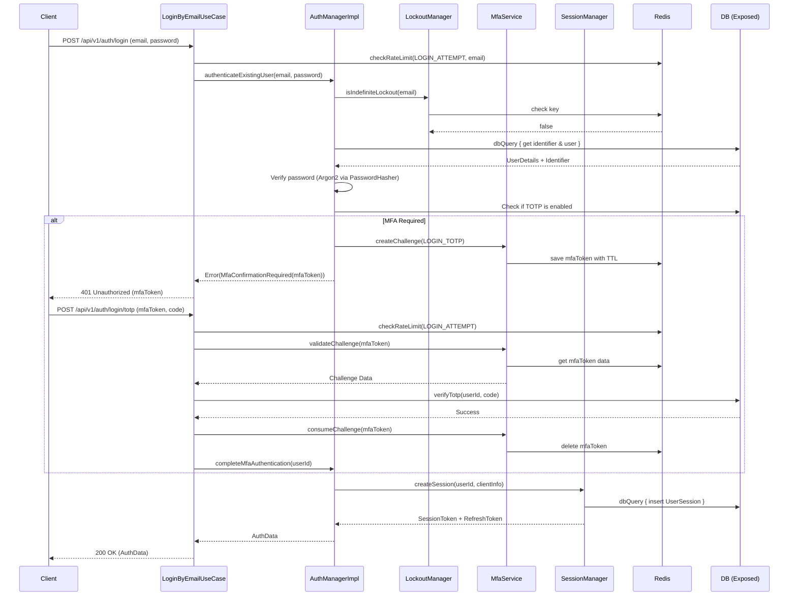
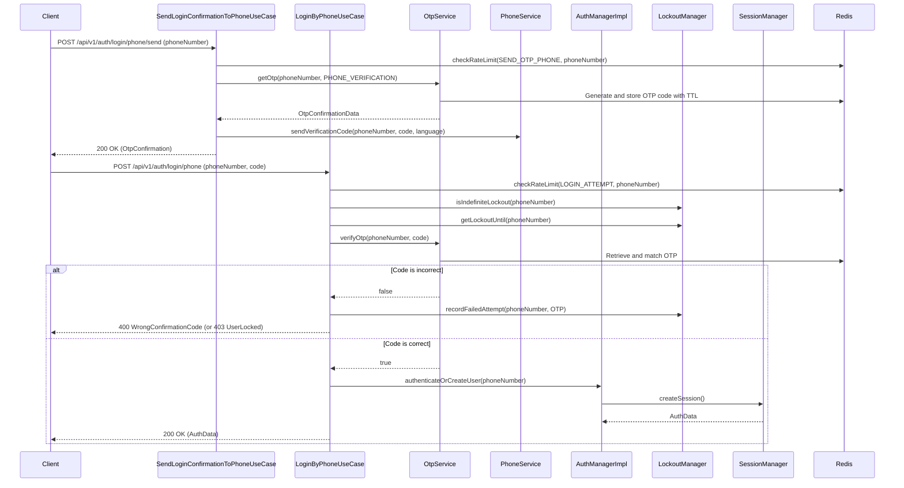
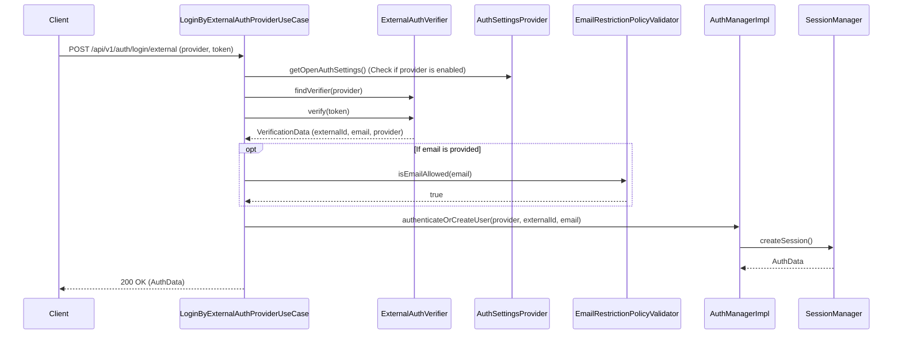
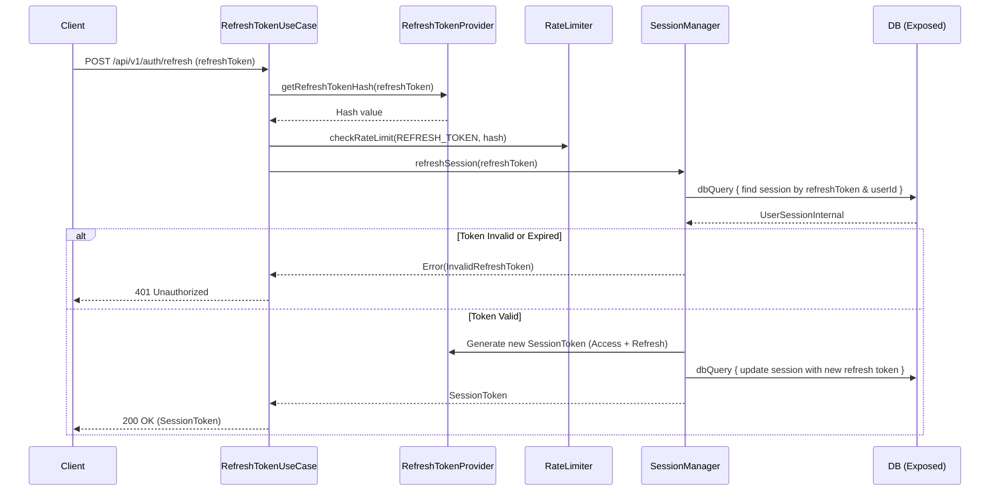

# Authentication Flows

This document details the critical sequence diagrams for user authentication within the `backend-platform-sdk`. The `feature:user` module handles these workflows, enforcing rate limits, MFA challenges, and audit logging.

## 1. Register by Email

Demonstrates the two-step process for registering a new user via email. It validates against domain restrictions, sends a secure OTP, and verifies the OTP to establish the initial session.

## 2. Login by Email (with TOTP MFA)

Demonstrates the flow when a user attempts to log in via email and password, and the account has TOTP enabled.

## 3. Login by Phone (OTP SMS)

Demonstrates the passwordless phone login flow. It requires generating an OTP, sending it via SMS, and verifying it before authentication.

## 4. Login by External Provider (OAuth/OIDC)

Handles identity federation via external providers like Google or Apple.

## 5. Token Refresh (Session Rotation)

Rotates access and refresh tokens. To prevent brute forcing, rate limiting is applied to the cryptographic hash of the refresh token.

