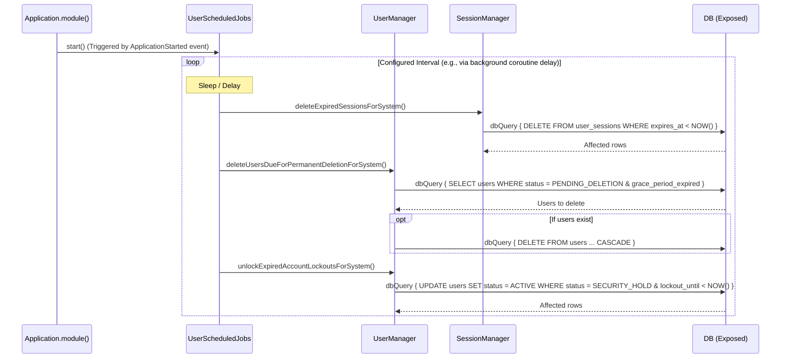

# Scheduled Background Jobs

This document outlines the scheduled jobs that run autonomously on the `BackgroundScope` to perform system maintenance and enforce security lifecycle policies.

## 1. Periodic Maintenance (UserScheduledJobs)

The `UserScheduledJobs` component starts an infinite coroutine loop (with a configurable delay) upon application startup. It delegates maintenance tasks to the `UserManager` and `SessionManager`.

