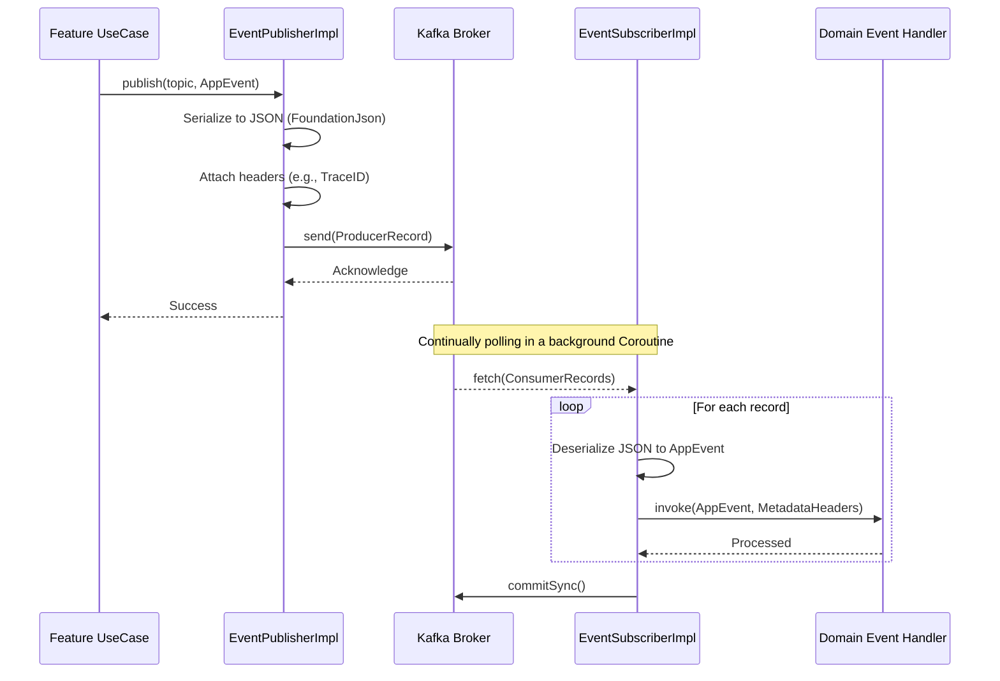
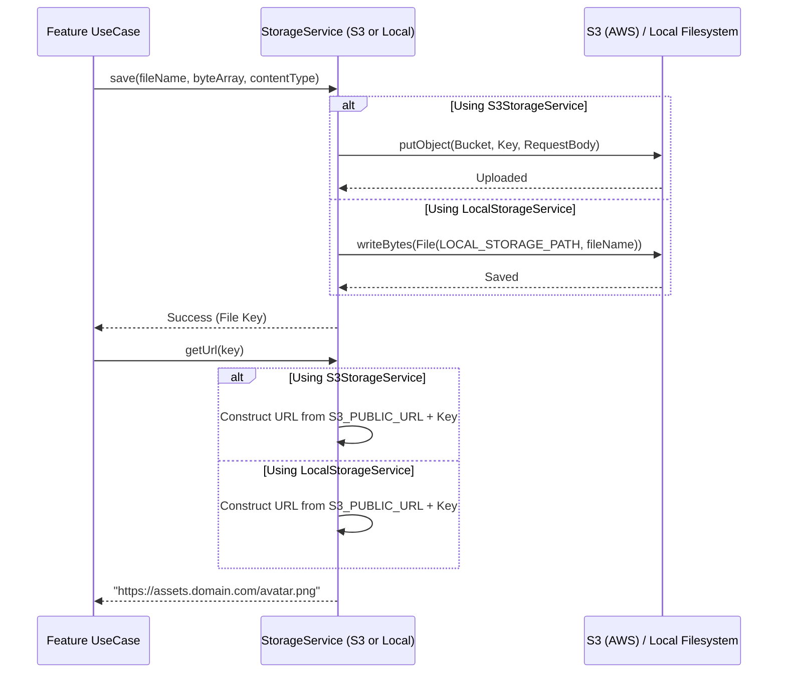

# Events & Storage Infrastructure

This document describes cross-cutting infrastructure services: Kafka event publishing and S3/Local file storage.

## 1. Event Publishing & Subscribing (Kafka)

The `core:events` module provides a decoupled way to broadcast domain events to external systems or microservices via Apache Kafka.

## 2. File Storage Abstraction (S3 / Local)

The `core:storage` module abstracts the complexity of blob storage, enabling seamless local development (using the filesystem) and production deployment (using S3/MinIO).

