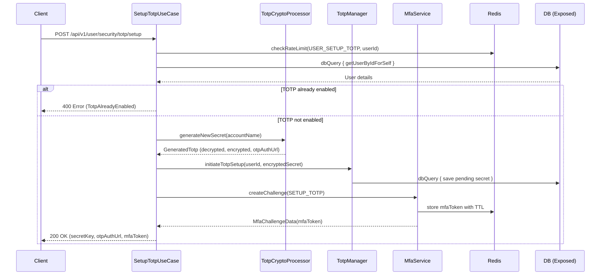
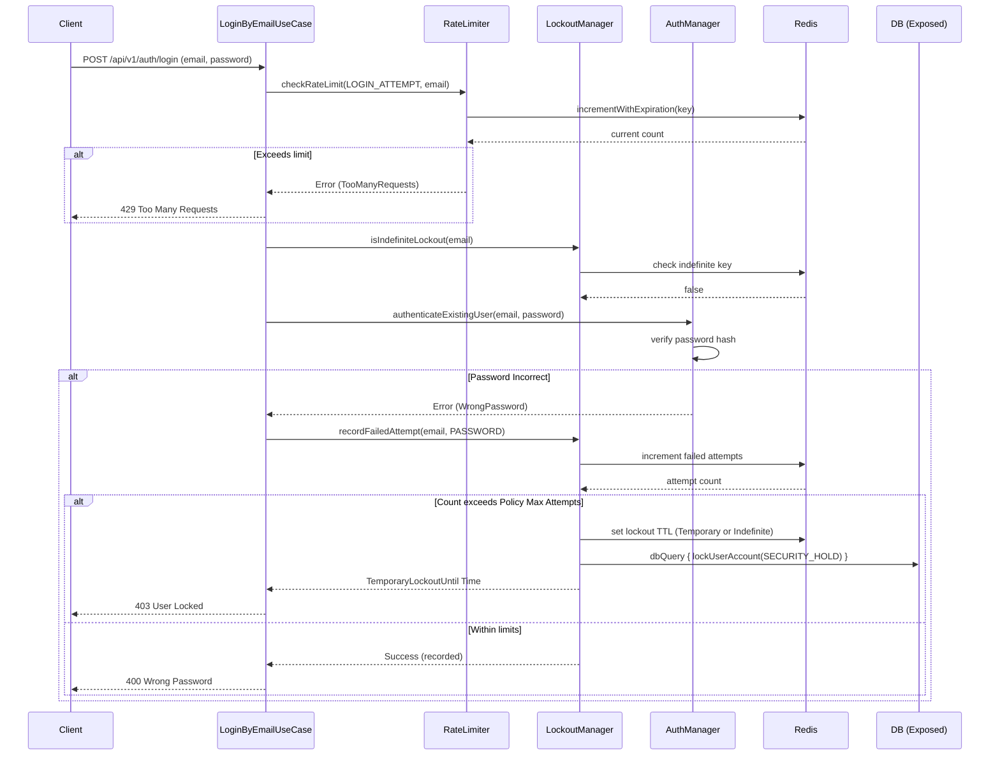

# Security Flows

This document details critical workflows for security setup (MFA) and brute-force protection mechanisms within the `backend-platform-sdk`.

## 1. Setup TOTP (MFA Initialization)

Demonstrates how a user initiates TOTP setup. It involves cryptographic generation, saving the encrypted secret provisionally, and issuing an MFA challenge token for the subsequent verification step.

*Note: The setup is not complete until the client calls `EnableTotpUseCase` with a valid code derived from the `secretKey` alongside the `mfaToken`.*

## 2. Lockout & Brute-Force Protection

The `LockoutManager` combined with `RateLimiter` secures authentication endpoints against credential stuffing and brute-force attacks. When thresholds are exceeded, the account is temporarily or permanently locked (moving to `SECURITY_HOLD`).

