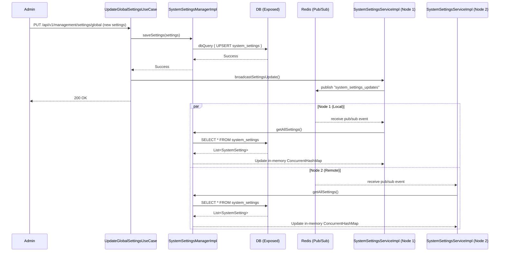

# Settings & Cache Synchronization

This document illustrates how global system settings are updated and synchronized across all active Ktor instances using Redis Pub/Sub, ensuring high availability and instant configuration reloads.

## 1. Settings Update & Broadcast

When an administrator updates a setting, the change is saved to the database. To avoid stale in-memory caches on other server nodes, a cache invalidation event is broadcast over Redis Pub/Sub.

*Note: The sequence below illustrates `GlobalSettings`. The exact same pattern is utilized for `SecuritySettings` and `AuthSettings`. Each settings domain has its own Use Cases and Caching Providers, but they all rely on Redis to broadcast invalidation events across the cluster.*

