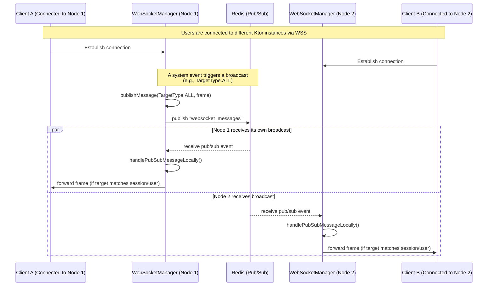

# WebSocket Flows

This document details how real-time synchronization is handled across multiple instances of the backend platform.

## 1. Multi-Instance WebSocket Synchronization (Stateless)

The `KtorWebSocketManager` leverages Redis Pub/Sub (`websocket_messages` channel) to broadcast WebSocket messages across the cluster, maintaining statelessness in individual node memory. This ensures that users connected to different physical or virtual instances can still exchange real-time updates seamlessly.

