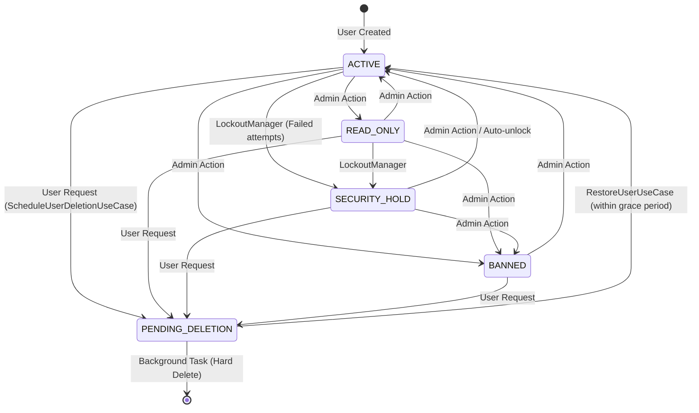

# Identity & Access Domain Models

This document defines the core domain entities that govern identity, authentication, and authorization within the `backend-platform-sdk`.

## 1. User Roles (`UserRole`)

Roles define the broad tier of access a user possesses:
- **`USER`**: Regular end-user with standard access to public features.
- **`STAFF`**: Employee/moderator role intended for operational work, typically granted specific domain permissions.
- **`ADMIN`**: Superuser with full access to system settings, audit logs, and global user management.

## 2. Permissions (`PermissionCode`)

While roles define broad tiers, the system uses granular permissions for precise access control, primarily for `STAFF` and `ADMIN` users on Management APIs.
- Permissions are strictly typed using sealed classes or enums (e.g., `AuditPermissionCode.READ`, `SettingsPermissionCode.GLOBAL_SETTINGS_UPDATE`).
- Request handlers and interceptors check these codes before executing privileged use cases.
- New administrators created via seeding (e.g., `SeedAdminAccountsUseCase`) are granted specific sets of these permissions as configured by the host application.

## 3. Account Statuses (`UserAccountStatus`)

The status of an account overrides its role and determines if the user can authenticate or perform actions:
- **`ACTIVE`**: Fully functional account.
- **`READ_ONLY`**: The user can view data but cannot mutate state (often used as a disciplinary or administrative action).
- **`BANNED`**: Complete restriction from the system.
- **`SECURITY_HOLD`**: Automatically applied by the system (e.g., via `LockoutManager`) when suspicious activity is detected, such as a brute-force attack. Prevents access until resolved or the penalty time expires.
- **`PENDING_DELETION`**: The user has requested account deletion. The account enters a "grace period" before a background job permanently deletes it.

### Account Status State Machine

## 4. User Identifiers (`UserIdentifier`)

An identifier represents a login method linked to a core `UserId`.
- **Providers (`UserAuthProvider`)**: `EMAIL`, `PHONE`, `GOOGLE`, `APPLE`, etc.
- **One-to-Many**: A single user can have multiple identifiers (e.g., an email address and a linked Google account).
- **Constraints**: The system strictly enforces uniqueness. A specific provider + identifier string (e.g., `EMAIL` + `user@example.com`) can only map to one user in the database.
- **Security**: Identifiers securely hold password hashes (for `EMAIL` or `PHONE` if a password is set) or external IDs (for OAuth).

## 5. User Sessions (`UserSession`)

Represents an active, authenticated login on a specific device.
- **Tokens**: Associated with a short-lived `SessionToken` (JWT) and a long-lived `RefreshToken` (persisted as a secure cryptographic hash in the database to prevent theft).
- **Device Metadata**: Tracks IP address, User-Agent, and `ClientDeviceInfo` (OS, App Version) for security auditing and new-device detection.
- **Lifecycle**: Has an `expiresAt` and `lastAccessedAt` timestamp.
- **MFA Step-up (`lastReauthenticatedAt`)**: Crucial for sensitive actions (like deleting the account or changing security settings). The system checks if `lastReauthenticatedAt` is within the configured `RECENT_AUTHENTICATION_VALIDITY_IN_SECONDS` window. If the session is too "old" contextually, the user is forced to re-authenticate (Step-up MFA) via the `AuthenticationChallengeService`.
